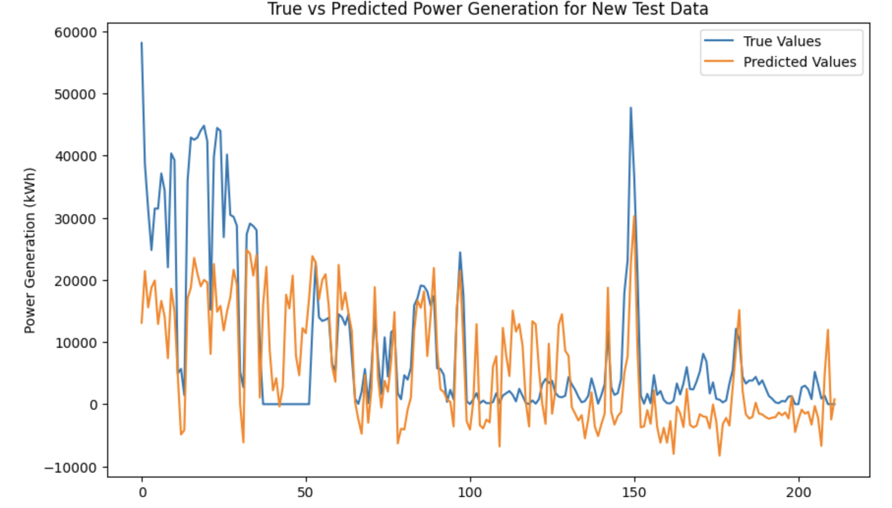
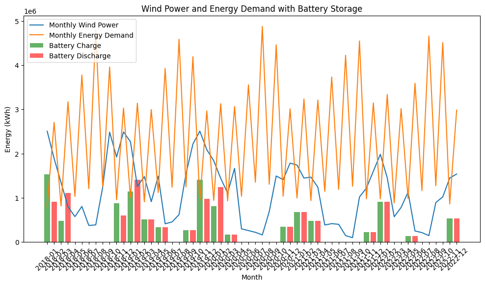

# Wind Energy Forecasting and Battery Storage Simulation

A deep learning project for wind power forecasting, electricity demand prediction, and battery energy storage simulation.

## Overview

This project explores the application of deep learning to renewable energy management.

The project consists of three major components:

1. Wind power generation forecasting
2. Electricity demand forecasting
3. Battery energy storage simulation

The goal is to evaluate whether AI-based forecasting can support more efficient utilization of wind energy and help estimate energy storage requirements.

## Project Workflow

The overall workflow includes:

- Data preprocessing
- Meteorological feature engineering
- Wind power forecasting
- Electricity demand forecasting
- Model evaluation
- Battery charging and discharging simulation
- Result visualization

## Models

### Wind Power Forecasting

Two deep learning architectures were evaluated:

- Long Short-Term Memory (LSTM)
- Temporal Convolutional Network (TCN)

Input features included meteorological and operational variables such as:

- Wind speed
- Wind direction
- Atmospheric pressure
- Sunshine duration
- Turbine operating hours

### Electricity Demand Forecasting

An LSTM model was used to predict monthly electricity consumption based on historical electricity demand data.

### Battery Energy Storage Simulation

A battery storage model was developed to simulate energy charging and discharging.

The simulation follows a simple strategy:

- Charge the battery when wind power generation exceeds electricity demand.
- Discharge the battery when electricity demand exceeds wind power generation.

## Data

The project uses publicly available data from:

- Taiwan Power Company
- Central Weather Administration (CODIS)

The datasets include:

- Wind power generation
- Turbine operating hours
- Meteorological measurements
- Regional electricity consumption

## Technologies

- Python
- TensorFlow / Keras
- pandas
- NumPy
- scikit-learn
- Matplotlib
- Google Colab


## Results

### Wind Power Forecasting

The trained models were evaluated on new wind power generation data.



### Battery Energy Storage Simulation

Battery charging and discharging were simulated according to the balance between wind power generation and electricity demand.




## Quantitative Results

The wind power forecasting models were evaluated using MAE and RMSE.

| Feature Set | Model | MAE (kWh) | RMSE (kWh) |
|---|---|---:|---:|
| Meteorological features | LSTM | 14,863 | 20,046 |
| Meteorological features | TCN | 12,585 | 17,914 |
| Meteorological + turbine operating hours | LSTM | **11,369** | 16,976 |
| Meteorological + turbine operating hours | TCN | 13,193 | 18,536 |
| Meteorological + turbine operating hours + loss-related features | LSTM | 11,614 | **16,937** |
| Meteorological + turbine operating hours + loss-related features | TCN | 14,040 | 18,827 |

Adding turbine operating-hour information improved the LSTM model, reducing MAE from approximately 14.9 thousand kWh to 11.4 thousand kWh, an improvement of approximately 23.5%.

## Requirements

This project was developed using Python with the following libraries:

- NumPy
- pandas
- Matplotlib
- scikit-learn
- TensorFlow

## Repository Structure

```text
wind-energy-forecasting-and-storage/
│
├── README.md
├── wind_energy_forecasting_and_storage.ipynb

